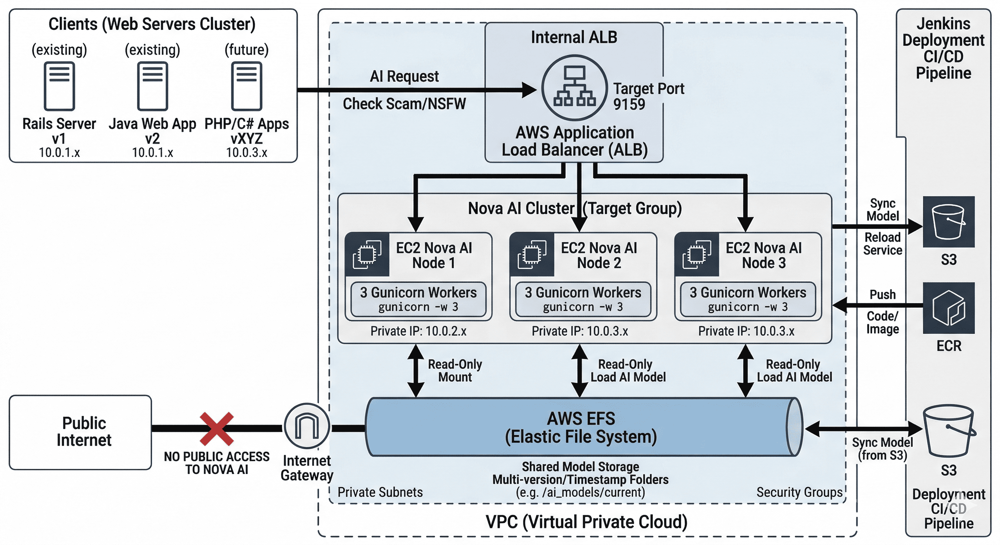

📜 TÀI LIỆU KIẾN TRÚC HỆ THỐNG NOVA AI (MULTI-PROJECT SCALE)
============================================================

1\. TỔNG QUAN HỆ THỐNG (OVERVIEW)
---------------------------------

Nova AI là một Shared Service (Dịch vụ dùng chung) cung cấp khả năng nhận diện Scam/NSFW cho toàn bộ hệ sinh thái của công ty (Rails, Java, PHP, C#...). Hệ thống được thiết kế để đảm bảo:

*   **High Availability:** Chạy trên cụm 3 máy EC2 (Tổng 9 Workers).
    
*   **Scalability:** Dễ dàng mở rộng thêm máy khi lượng request từ các Team XYZ tăng cao.
    
*   **Zero-Downtime:** Cập nhật Model và Code không làm gián đoạn dịch vụ.
    
Đây là cách các Web App (Rails, Java, PHP...) tương tác với cụm Nova AI thông qua hạ tầng mạng nội bộ của AWS.

<!--  -->

<div align="center">
  
  <p><i>Sơ đồ 1: Kiến trúc luồng dữ liệu Nova AI qua Internal ALB</i></p>
</div>

**🛰️ Giải thích luồng đi (Traffic Flow):**

1.  **Clients (Web Servers):** Các con Web Rails (hiện tại) và Java, PHP (tương lai) đóng vai trò là Client. Chúng không gọi trực tiếp IP của từng máy Nova AI.
    
2.  **Internal Load Balancer (ALB):** Tất cả các team chỉ cần nhớ một địa chỉ duy nhất (DNS nội bộ), ví dụ: http://nova-ai.internal:9159. ALB sẽ đứng ra nhận request và kiểm tra xem con máy Nova AI nào đang rảnh. Nếu 1 con Nova AI bị sập, ALB tự động ngắt và đẩy request sang con khác (High Availability).
    
3.  **Nova AI Cluster (3 Nodes):** ALB phân phối request xuống 3 con EC2. Tại đây, mỗi con máy có 3 Workers (tổng 9 Workers) đang đợi sẵn để xử lý AI.
    
4.  **Shared Storage (EFS):** Cả 3 con máy Nova AI đều nhìn chung vào một "giỏ" dữ liệu duy nhất là EFS để đảm bảo tất cả Workers đều dùng chung một phiên bản Model. Khi Jenkins cập nhật Model mới lên EFS, cả 9 Workers đều dùng chung một phiên bản duy nhất mà không cần copy dữ liệu đi đâu cả.


2\. KIẾN TRÚC TRIỂN KHAI (DEPLOYMENT STRATEGY)
----------------------------------------------
Để đi đến quyết định cuối cùng, chúng ta đã xem xét 3 kịch bản phổ biến trên AWS:

### Kịch bản A: Jenkins Rsync trực tiếp (Truyền thống)

*   **Cách làm:** Jenkins server giữ Model 1.1GB và dùng lệnh rsync đẩy sang từng con EC2 qua SSH.
    
*   **Ưu điểm:** Không tốn thêm chi phí dịch vụ lưu trữ như S3.
    
*   **Nhược điểm:** **Nghẽn mạng:** Đẩy 1GB sang 3 máy cùng lúc làm chậm băng thông của Jenkins.
    
    *   **Disk Full:** Ổ cứng Jenkins và EC2 dễ bị đầy nếu không dọn dẹp model cũ thủ công.
        
    *   **Security:** Jenkins phải giữ SSH Key của các máy Production, tiềm ẩn rủi ro bảo mật.
        

### Kịch bản B: S3 Sync (Local Copy)

*   **Cách làm:** Model lưu trên S3. Mỗi máy EC2 khi khởi động hoặc có lệnh sẽ chạy aws s3 sync để tải model về ổ cứng Local (EBS).
    
*   **Ưu điểm:** Chi phí lưu trữ S3 rất rẻ. Tốc độ đọc từ SSD Local cực nhanh.
    
*   **Nhược điểm:** **Độ trễ khi Scale:** Khi cần bật thêm máy EC2 thứ 4, máy đó phải đợi tải xong 1GB mới có thể phục vụ (Cold Start).
    
    *   **Quản lý rời rạc:** Phải đảm bảo lệnh sync chạy thành công trên tất cả các máy. Nếu 1 máy lỗi sync, nó sẽ chạy Model cũ trong khi các máy khác chạy Model mới.
        

### Kịch bản C: EFS Shared Storage (Chọn lựa cuối cùng)

*   **Cách làm:** Model lưu tập trung trên ổ cứng mạng EFS. 3 máy EC2 cùng trỏ (Mount) vào một thư mục duy nhất.
    
*   **Ưu điểm:** **Nhất quán (Consistency):** Chỉ cần cập nhật Model 1 lần trên EFS, tất cả Workers thấy ngay lập tức.
    
    *   **Scale thần tốc:** Thêm máy mới là chạy được ngay, không tốn thời gian tải Model.
        
    *   **Nhàn hạ cho DevOps:** Không lo dọn dẹp ổ cứng từng máy, không lo đầy dung lượng (EFS tự co giãn).
        
*   **Nhược điểm:** Chi phí cao hơn S3 một chút, nhưng bù lại bằng sự ổn định và giảm công sức vận hành.
    

### Tại sao chúng ta chọn EFS?

Chúng ta chọn **Kịch bản C (EFS)** vì những lý do chiến lược sau:

1.  **Hỗ trợ Multi-version & Rollback (Trọng tâm):** Với cấu trúc folder theo Timestamp (ví dụ: /ai\_data/versions/20260406\_0900), EFS cho phép chúng ta lưu nhiều phiên bản Model cùng lúc. Việc Rollback rất nhanh bằng cách đảo Symlink current, thay vì phải tải lại 1GB từ S3.
    
2.  **Tách biệt tuyệt đối Code và Data (Decoupling):** Code Python (nhẹ) nằm trên SSD máy. Model AI (nặng) nằm trên EFS. Khi sửa 1 dòng code, Jenkins chỉ deploy vài KB code, cực kỳ nhanh. Khi đổi Model, chỉ tác động vào EFS. Không bao giờ lo việc sửa code làm hỏng dữ liệu AI và ngược lại.
    
3.  **Hệ sinh thái Shared Service:** Vì Nova AI sẽ phục vụ cho Web Rails, Java, PHP... nên việc có một "Kho tri thức" tập trung như EFS giúp hệ thống trở nên **Stateless** (Không trạng thái). Các máy EC2 Nova AI giờ đây chỉ là "công nhân" tính toán, có thể thay thế hoặc thêm bớt bất cứ lúc nào mà không sợ mất dữ liệu.
    
4.  **Tương thích hoàn hảo với Jenkins Pipeline:** Jenkins chỉ cần quản lý đúng một điểm đến (Mount point của EFS) thay vì phải đi quản lý danh sách IP của từng máy EC2 để rsync dữ liệu.


|Tiêu chí            |Rsync (Kịch bản A)|S3 Sync (Kịch bản B)|EFS (Kịch bản C)|
|--------------------|------------------|--------------------|----------------|
|Tốc độ Deploy       |Chậm              |Trung bình          |Rất nhanh       |
|Độ nhất quán dữ liệu|Thấp              |Trung bình          |Tuyệt đối       |
|Khả năng Rollback   |Khó               |Trung bình          |Cực dễ          |
|Độ nhàn cho DevOps  |Cực thấp          |Trung bình          |Rất cao         |


### 📁 Cấu trúc thư mục trên EC2

Để tách biệt Logic và Dữ liệu nặng (1.1GB), chúng ta áp dụng mô hình **Hybrid Storage**:

*   **/home/ubuntu/nova-ai/ (Local SSD):** Chứa Source code, Virtual Env và các file dữ liệu cũ (data/ chứa FAISS index).
    
*   **/home/ubuntu/ai\_models/ (Mount từ EFS):** Chứa các phiên bản Model AI khổng lồ.
    

### 🔄 Quy trình Deploy Multi-version (Atomic Switch)

Chúng ta không sửa file .env. Việc chuyển đổi phiên bản được thực hiện qua **Symlink** trên EFS:

1.  **Sync:** Jenkins đẩy Model mới vào folder timestamp trên EFS: ai\_models/versions/20260406\_0900/.
    
2.  **Switch:** Cập nhật Symlink ai\_models/current trỏ về folder mới.
    
3.  **Reload:** Chạy pm2 reload để 9 Workers nạp model mới tuần tự (Zero-downtime).
    

3\. KẾT NỐI MẠNG: PRIVATE LINK VS PUBLIC LINK
---------------------------------------------

Đây là phần quan trọng nhất để đảm bảo hiệu năng và bảo mật khi các team Java, PHP, C# cùng nhảy vào sử dụng.

### 🛡️ Lựa chọn tối ưu: Private Link (VPC Internal)

Tất cả các Service (Rails, Java, PHP) nằm cùng Region AWS với Nova AI **bắt buộc** phải dùng Private IP hoặc Internal Load Balancer.

|Tiêu chí  |Private Link (Khuyên dùng)                                                                    |Public Link (Hạn chế)                                                           |
|----------|----------------------------------------------------------------------------------------------|--------------------------------------------------------------------------------|
|Bảo mật   |Tuyệt đối. Traffic không đi ra Internet, tránh bị scan port hoặc tấn công DDoS từ ngoài.      |Nguy cơ cao. Phải quản lý IP Whitelist cực kỳ gắt gao.                          |
|Tốc độ    |Siêu nhanh. Độ trễ (Latency) thấp nhất vì đi trong mạng xương sống của AWS.                   |Chậm hơn. Phải đi qua Internet Gateway và chịu ảnh hưởng của băng thông quốc tế.|
|Chi phí   |0 VNĐ. AWS không tính phí truyền tải dữ liệu (Data Transfer) trong cùng AZ/VPC qua Private IP.|Tốn phí. Tính tiền băng thông (Data Transfer Out) theo từng GB.                 |
|Độ ổn định|100%. Không phụ thuộc vào đứt cáp quang hay sự cố mạng công cộng.                             |Phụ thuộc vào nhà mạng và tuyến cáp quang.                                      |


### 🛰️ Kịch bản sử dụng:

1.  **Nội bộ công ty (Rails, Java, PHP...):** Dùng **Internal Application Load Balancer (ALB)**. Các team trỏ về DNS nội bộ (ví dụ: nova-ai.internal:9159).
    
2.  **Đối tác bên ngoài (Nếu có):** Chỉ khi đó mới mở Public Endpoint qua **API Gateway** hoặc **Public ALB**, kèm theo cơ chế xác thực API Key/JWT chặt chẽ.
    

4\. QUY HOẠCH PORT (PORT PLANNING)
----------------------------------

Để tránh đụng hàng với các dịch vụ mặc định và các team khác, Nova AI chốt sử dụng dải Port định danh riêng:

*   **Port định danh: 9159** (Dễ nhớ: AI = 1-9).
    
*   Cấu hình Gunicorn:
```bash
gunicorn -w 3 -k uvicorn.workers.UvicornWorker app.main:app --bind 0.0.0.0:9159 --timeout 60
```
*   **Security Group:** Chỉ mở Port 9159 cho các Security Group ID của các Team (Web Rails SG, Web Java SG...). Không mở cho 0.0.0.0/0.
    

5\. KẾ HOẠCH DỰ PHÒNG (ROLLBACK PLAN)
-------------------------------------

Nhờ mô hình **EFS + Symlink + PM2 Reload**, việc Rollback được thực hiện trong 3 bước:

1.  **Đảo Link:** ln -sfn /ai\_models/versions/\[OLD\_TIMESTAMP\] /ai\_models/current
    
2.  **Reload:** pm2 reload all
    
3.  **Xác nhận:** Kiểm tra log để đảm bảo Workers đã nạp lại Model cũ thành công.
    

**Kết luận:** Với cấu trúc này, Nova AI không còn là một script Python chạy lẻ tẻ mà đã trở thành một **Core Service** thực thụ, sẵn sàng phục vụ hàng chục Project khác nhau trong tương lai mà vẫn đảm bảo sự ổn định và nhàn nhã cho khâu vận hành (DevOps).

6\. CHIẾN LƯỢC TRIỂN KHAI QUA JENKINS (CI/CD PIPELINE)
------------------------------------------------------

Để quản lý cụm 3 máy EC2 và dữ liệu khổng lồ trên EFS mà không cần can thiệp thủ công, Jenkins sẽ đóng vai trò điều phối theo mô hình **"Tách biệt Build Code và Sync Data"**.

### 📦 Sử dụng AWS ECR (Elastic Container Registry) làm nơi lưu trữ Container Image cho Nova AI

**🛡️ 1. Bảo mật cấp độ cao (IAM Role Integration)**

*   **Không dùng Token/Password:** Nếu dùng GitHub Registry, chúng ta phải lưu trữ _Personal Access Token (PAT)_ trên các máy EC2 hoặc trong Jenkins. Nếu lộ Token này, kẻ xấu có thể truy cập vào toàn bộ Source Code của công ty.
    
*   **Cơ chế IAM:** Với ECR, chúng ta sử dụng **IAM Role**. Các máy EC2 Nova AI chỉ cần được gán quyền ECRReadOnly. Không có mật khẩu nào được lưu trữ, không có rủi ro lộ lọt thông tin đăng nhập.
    

**⚡ 2. Tốc độ và Hiệu năng nội bộ (Low Latency)**

*   **Băng thông nội bộ:** ECR nằm cùng hạ tầng vật lý với EC2. Khi thực hiện lệnh docker pull, dữ liệu chạy qua mạng xương sống (Backbone) của AWS với tốc độ cực cao. Nếu ECR và EC2 cùng nằm trong một Region (ví dụ Singapore), AWS miễn phí hoàn toàn tiền băng thông khi pull image về.
    
*   **Không phụ thuộc Internet:** Pull image từ GitHub phải đi qua đường truyền quốc tế. Trong trường hợp đứt cáp quang hoặc GitHub gặp sự cố, hệ thống Nova AI sẽ không thể Scale-up hoặc Deploy bản vá lỗi kịp thời.
    

**🌐 3. Phù hợp kiến trúc VPC (Private Subnet)**

*   **VPC Endpoint:** Theo thiết kế bảo mật, cụm Nova AI nằm trong **Private Subnet** (không có đường ra Internet trực tiếp).
    
*   **Giải pháp:** EFS và ECR đều hỗ trợ kết nối qua **VPC Endpoint**. Điều này cho phép EC2 kéo Image và Model về mà **không cần mở cổng Internet (NAT Gateway)**, giúp tiết kiệm chi phí băng thông và tối đa hóa khả năng cô lập hệ thống khỏi các mối đe dọa bên ngoài.
    

**💰 4. Tối ưu hóa chi phí**

*   **Data Transfer:** AWS miễn phí tiền băng thông (Data Transfer In/Out) nếu ECR và EC2 nằm cùng một Region.
    
*   **Lưu trữ:** Với dung lượng Image code cực nhẹ (do Model đã tách ra EFS), chi phí lưu trữ trên ECR chỉ rơi vào khoảng **$0.05 - $0.1 / tháng**, một con số không đáng kể so với lợi ích về bảo mật mang lại.

### 🔄 Luồng Workflow của Jenkins (Pipeline):

1.  **Stage 1: Checkout & Test**
    
    *   Jenkins kéo code mới nhất từ Git. Chạy các bản Unit Test để đảm bảo logic Python/FastAPI không có lỗi.
        
2.  **Stage 2: Check & Sync Model (Data Heavy)**
    
    *   Jenkins kiểm tra xem có sự thay đổi về Model AI không (dựa trên commit hoặc cấu hình version).
        
    *   **Nếu có Model mới:** Jenkins thực hiện lệnh aws s3 sync để đẩy model từ kho lưu trữ S3 lên thư mục timestamp mới trên **EFS**.
        
    *   **Nếu không có Model mới:** Bỏ qua bước này để tiết kiệm thời gian (chỉ mất vài giây).
        
3.  **Stage 3: Build & Push Image (Nếu dùng Docker)**
    
    *   Jenkins build Docker Image (chỉ chứa code, không chứa model).
        
    *   Push Image lên **AWS ECR**.
        
4.  **Stage 4: Deployment to Cluster (3 EC2s)**
    
    *   Jenkins sử dụng **SSH/Ansible** hoặc **AWS SSM** để ra lệnh cho 3 con EC2 cùng lúc:
        
        *   **Pull Code/Image:** Cập nhật bản code mới nhất.
            
        *   **Update Symlink:** Chạy lệnh ln -sfn trên EFS để trỏ folder current sang phiên bản Model mong muốn.
            
        *   **PM2 Reload:** Thực hiện pm2 reload nova-ai-service.
            

### 🛠️ Các đặc quyền kỹ thuật trong Jenkins:

*   **Tham số hóa (Parameterized Build):**
    
    *   Jenkins sẽ có các nút chọn: DEPLOY\_MODEL\_VERSION, ROLLBACK\_TO\_PREVIOUS. Khi có sự cố, bạn chỉ cần chọn version cũ và nhấn "Build", Jenkins sẽ tự đảo Symlink cho bạn.
        
*   **Quản lý SSH Key:**
    
    *   Sử dụng **Credentials Binding Plugin** để lưu trữ Private Key truy cập EC2 một cách bảo mật, không để lộ trong log của Jenkins.
        
*   **Thông báo (Notifications):**
    
    *   Tích hợp Slack/Telegram để báo cáo trạng thái: "Nova AI Version 20260410 đã lên sóng thành công trên 3 Nodes (9 Workers)".

8\. CHIẾN LƯỢC MỞ RỘNG ĐA DỊCH VỤ (MULTI-SERVICE CONNECTIVITY)
--------------------------------------------------------------

Để phục vụ cho lộ trình từ 1 team Web (Rails) lên 10+ team Web (Java, PHP, C#...), Nova AI áp dụng mô hình kết nối linh hoạt dựa trên quy mô hệ thống.

### 8.1. Giai đoạn khởi đầu (1 - 5 Team Web)

*   **Mô hình:** **VPC Peering (Star Topology)**.
    
*   **Cách thức:** Thiết lập kết nối 1-1 trực tiếp từ VPC của từng team Web trỏ về VPC của Nova AI.
    
*   **Lý do chọn:** \* **Chi phí:** $0$ VNĐ phí khởi tạo/duy trì. Chỉ trả phí truyền tải dữ liệu nội bộ thấp.
    
    *   **Hiệu năng:** Độ trễ thấp nhất do kết nối trực tiếp.
        
*   **Quản lý:** Nova AI đóng vai trò là "Hub" trung tâm trong sơ đồ hình sao.
    

### 8.2. Giai đoạn mở rộng ( > 5 Team Web)

*   **Mô hình:** **AWS Transit Gateway (Hub-and-Spoke)**.
    
*   **Cách thức:** Xây dựng một "Nhà ga trung tâm" (Transit Gateway). Tất cả các VPC (Web Apps & Nova AI) đều chỉ cần 1 kết nối duy nhất về nhà ga này.
    
*   **Lý do chọn:** \* **Đơn giản hóa:** Loại bỏ việc quản lý hàng chục bảng định tuyến (Route Tables) chồng chéo.
    
    *   **Tự động hóa:** Team Web mới chỉ cần "cắm" vào Transit Gateway là tự động thông suốt với Nova AI mà không cần cấu hình lại phía Nova AI.
        
    *   **Bảo mật tập trung:** Dễ dàng kiểm soát lưu lượng giữa các VPC tại một điểm duy nhất.
        

### 8.3. Bảng so sánh chi phí & Vận hành

|Quy mô  |Giải pháp      |Chi phí vận hành         |Độ phức tạp cấu hình        |
|--------|---------------|-------------------------|----------------------------|
|< 5 VPCs|VPC Peering    |Thấp (Trả theo GB)       |Thấp (Quản lý ít Route)     |
|> 5 VPCs|Transit Gateway|Trung bình (Phí giờ + GB)|Rất thấp (Quản lý tập trung)|


### 8.4 Gợi ý cho DevOps khi đọc mục này:
------------------------------------

1.  **Về định tuyến (Routing):** Nova AI luôn nằm trong dải IP cố định. Khi dùng VPC Peering, chỉ cần update Route Table của Web VPC trỏ dải IP của Nova AI qua Peering Connection.
    
2.  **Về bảo mật (Security Group):** Nova AI Security Group nên cho phép (Allow) Port **9159** từ các dải CIDR của các VPC Web đã được phê duyệt.
    
3.  **Về Multi-Region:** Nếu có Web App nằm ngoài Region Singapore, ưu tiên sử dụng **Inter-Region VPC Peering** để đi qua đường truyền riêng của AWS, tránh public ra Internet.